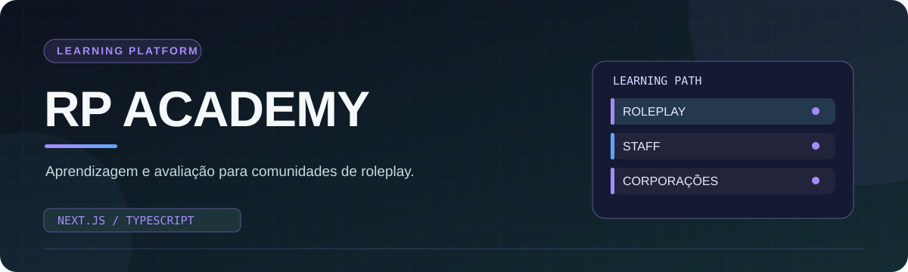
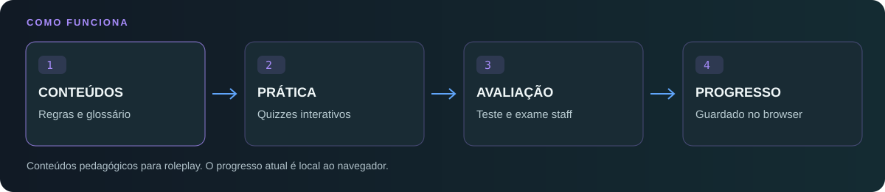

  
    
  
  
  
  <h3>Aprender regras, praticar decisões e acompanhar o progresso.</h3>
  
<a href="https://rp-academy.vercel.app/">Abrir demonstração</a> · <a href="#funcionalidades">Funcionalidades</a> · <a href="#instalação-local">Instalação</a>

## Porque criei a RP Academy

Queria transformar materiais de formação para comunidades de roleplay numa plataforma navegável, onde fosse possível consultar conceitos, praticar com questões e rever resultados. A RP Academy reúne **conteúdos de roleplay, avaliação de staff e guias de corporações** numa aplicação web.

<table><tr>
<td width="50%" valign="top"><h3>01 · Aprender</h3>
Regras RP, glossário pesquisável e exemplos organizados por categoria.
</td>
<td width="50%" valign="top"><h3>02 · Praticar</h3>
Questões interativas com feedback para consolidar os conteúdos.
</td>
</tr><tr>
<td valign="top"><h3>03 · Avaliar</h3>
Teste staff e exame com resultados apresentados na plataforma.
</td>
<td valign="top"><h3>04 · Consultar</h3>
Guias de corporações reunidos numa navegação própria.
</td>
</tr></table>

## O percurso de aprendizagem

O progresso atual é guardado em **localStorage no navegador**. Isto permite retomar a experiência nesse mesmo navegador, mas não corresponde a uma conta sincronizada entre dispositivos ou a um registo oficial de formação.

## Funcionalidades

| Módulo | O que está presente no código |
| :--- | :--- |
| Roleplay | Regras, glossário, pesquisa e questionário de 15 questões. |
| Staff: teste | 20 questões com correção durante a experiência. |
| Staff: exame | 15 questões selecionadas para uma sessão com limite de 10 minutos. |
| Corporações | Navegação por sete áreas com guias, hierarquias e procedimentos para contextos RP. |
| Progresso | Registo local de pontuação, tentativas e resultados dos módulos. |

> [!NOTE]
> As regras e os procedimentos destinam-se a **cenários de roleplay**. Não substituem documentação, formação ou procedimentos de instituições reais. A interface e os conteúdos continuam em desenvolvimento.

## Tecnologias

| Camada | Tecnologia |
| :--- | :--- |
| Aplicação | Next.js 16 e React 19 |
| Linguagem | TypeScript |
| Estilos | Tailwind CSS e CSS global |
| Animações | Framer Motion |
| Recursos de UI | Lucide React |
| Persistência de progresso | localStorage |

## Instalação local

Instala uma versão de Node.js compatível com Next.js 16 e executa:

~~~bash
git clone https://github.com/NexysT/RP-Academy.git
cd RP-Academy
npm ci
npm run dev
~~~

Abre `http://localhost:3000`. Para verificares o estado do código na tua máquina:

~~~bash
npm run lint
npm run build
~~~

## Organização do repositório

~~~text
app/          Páginas e rotas
components/   Quiz, navegação e componentes reutilizáveis
data/         Perguntas, glossário e conteúdos das corporações
hooks/        Progresso local e notificações
lib/          Utilitários
types/        Tipos TypeScript
public/       Recursos estáticos
assets/       Grafismos deste README
~~~

## Evolução

Quero continuar a trabalhar a acessibilidade, a validação dos conteúdos e os testes da interface. A autenticação, a sincronização entre dispositivos e uma API para integração com servidores são **possibilidades futuras**, não funcionalidades anunciadas como concluídas.

Se encontrares um erro, podes abrir uma [issue](https://github.com/NexysT/RP-Academy/issues) e indicar a página, os passos e o comportamento observado.

 Projeto de <a href="https://github.com/NexysT">Carlos Pereira / NexysT</a> · Portugal · Documentação em português europeu

